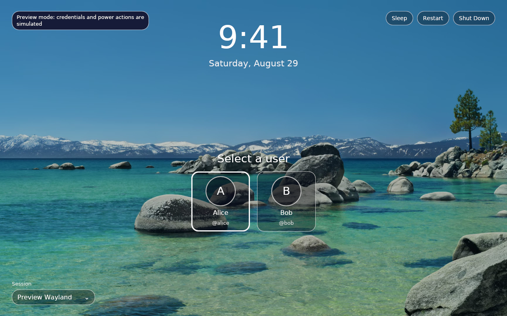
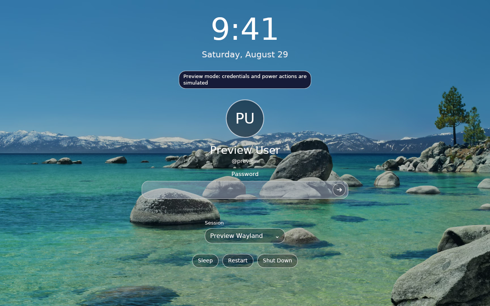
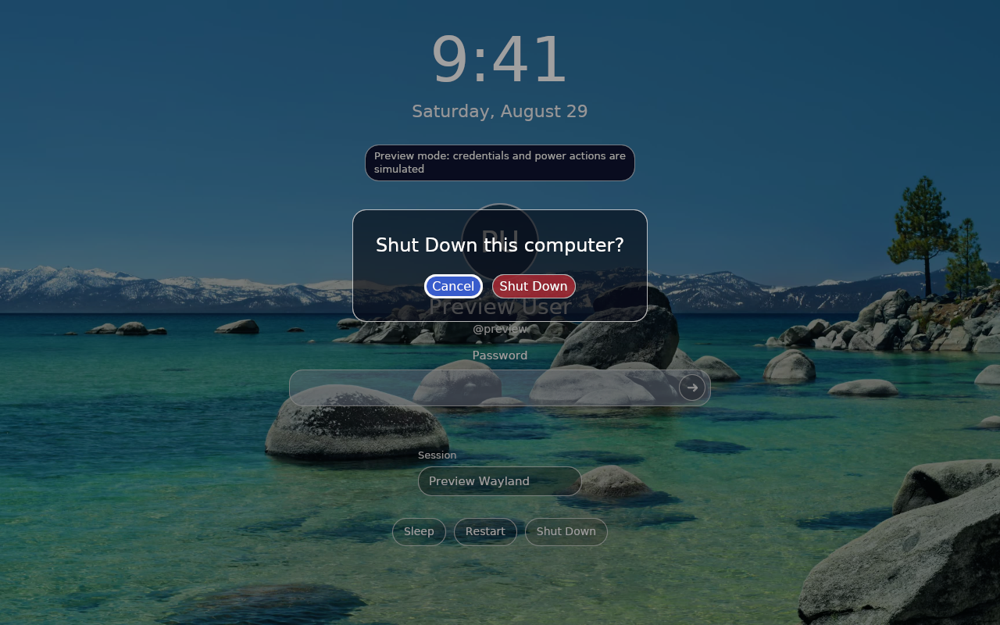

# Genkan

Genkan is a graphical [greetd](https://sr.ht/~kennylevinsen/greetd/)
frontend for Linux, built with Rust and iced. It runs fullscreen under Cage on
a Wayland login VT while greetd remains responsible for PAM authentication and
starting the selected desktop session.

## Screenshots

| Account selection | Authentication |
|:--:|:--:|
| [](rfd/0001/reference-images/account-selection.png) | [](rfd/0001/reference-images/secret-prompt.png) |

[](rfd/0001/reference-images/power-confirmation.png)

These are deterministic development-preview captures. The preview uses
synthetic accounts and sessions and never sends credentials or power requests.

## Features

- PAM conversation handling through greetd, including multi-prompt flows.
- AccountsService user discovery with keyboard and pointer navigation.
- Validated Wayland desktop-session discovery without invoking a shell.
- Confirmed sleep, restart, and shutdown actions through logind.
- Original-resolution Tahoe Beach and Sequoia animated wallpapers with static
  posters, reduced-motion support, smooth loop transitions, and safe fallback.
- Reproducible Nix packaging for x86_64-linux and aarch64-linux.
- Service-free deterministic previews for UI development and review.
- An experimental `ext-session-lock-v1` compositor boundary with fail-closed
  multi-output coverage and lock-confirmation readiness reporting.

## Try the UI

Enter the Nix development shell, then launch the safe preview:

```sh
nix develop
make dev
```

Select another UI state with `PREVIEW`:

```sh
PREVIEW=users make dev
PREVIEW=visible-prompt make dev
PREVIEW=power-confirmation make dev
```

To preview the real wallpaper animation while keeping authentication and power
actions simulated:

```sh
make animated-dev
WALLPAPER=sequoia-night make animated-dev
```

See the [development guide](docs/development.md) for all preview, wallpaper,
test, VM, and hardware-smoke workflows.

## Install with NixOS

Add Genkan as a flake input and configure greetd to launch the package under
Cage. A minimal host configuration and the required AccountsService, session,
graphics, PAM, and power-policy details are in the
[deployment guide](docs/deployment.md).

```nix
services.greetd = {
  enable = true;
  settings.default_session = {
    user = "greeter";
    command = "${pkgs.cage}/bin/cage -- ${genkanPackage}/bin/genkan login";
  };
};
```

The packaged greeter animates Tahoe Beach by default. Operators can select
`sequoia-sunrise`, `sequoia-morning`, or `sequoia-night`, or use
`--reduce-motion` to retain the corresponding static poster.

## Session-lock development status

`genkan lock` now establishes and maintains an opaque compositor-owned lock on
every output. Production unlock authentication is Phase 5 of
[RFD 3](rfd/0003/README.adoc) and is not implemented yet. Until then, do not use
the lock command as a daily locker: it intentionally has no production unlock
path and may require recovery from another VT. The packaged test suite uses a
separately compiled test-only authorization source against nested headless
Sway; that source is absent from the production package.

## Documentation

- [Deployment and greetd configuration](docs/deployment.md)
- [Development and verification](docs/development.md)
- [Requests for Discussion](rfd/README.adoc)
- [Deferred work](docs/deferred.md)

## Validation

Run the complete local verification suite with:

```sh
nix develop --command make verify
```

This checks formatting, Clippy, Rust and shell regressions, RFD metadata,
reference images, the Nix package, and packaged graphics startup under nested
Cage and headless Weston, plus compositor lock confirmation and explicit test
unlock under nested headless Sway.

## License

Genkan source code is licensed under the [MIT License](LICENSE). Packaged
wallpaper provenance and integrity metadata are recorded separately in
[RFD 2](rfd/0002/README.adoc) and the
[wallpaper manifest](assets/wallpapers/manifest.toml).
