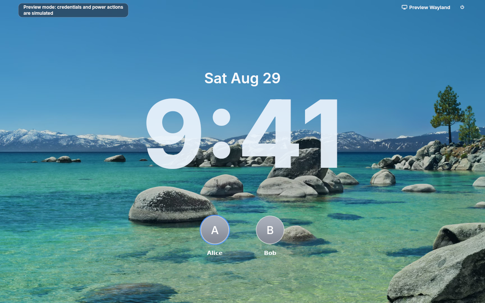
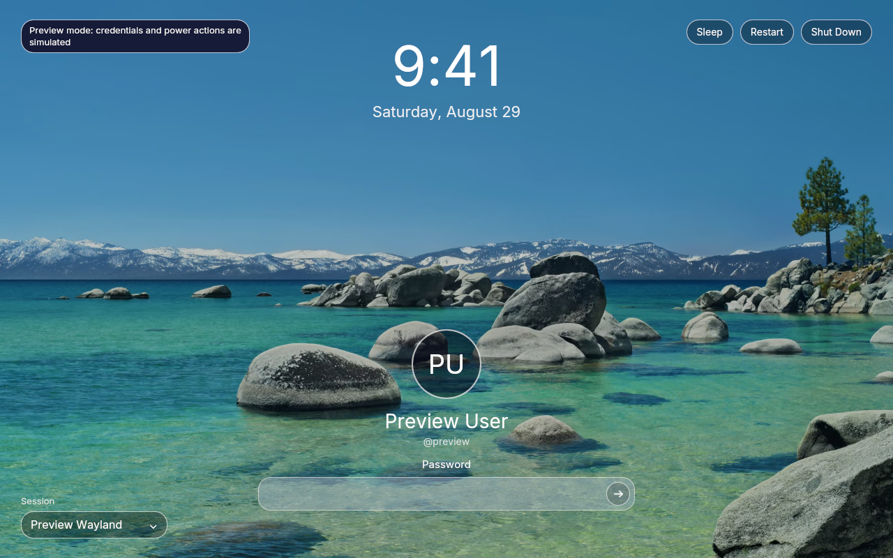
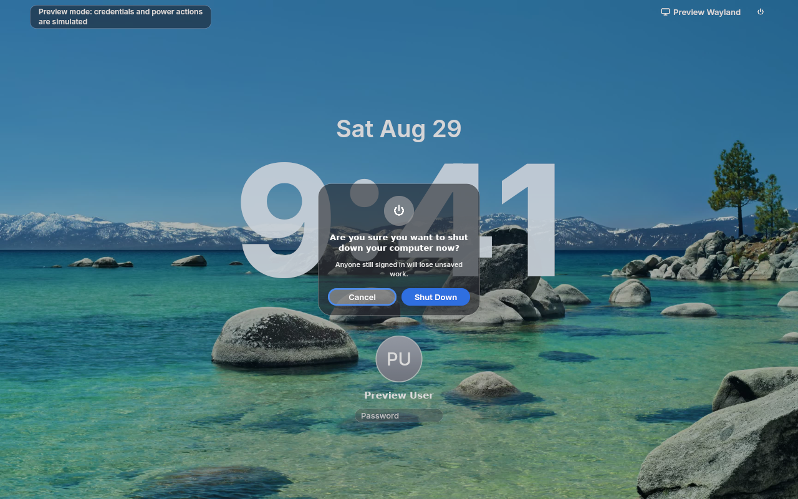

# Genkan

Genkan is a graphical [greetd](https://sr.ht/~kennylevinsen/greetd/)
frontend for Linux, built with Rust and iced. It runs fullscreen under Cage on
a Wayland login VT while greetd remains responsible for PAM authentication and
starting the selected desktop session.

## Screenshots

| Account selection | Authentication |
|:--:|:--:|
| [](rfd/0001/reference-images/account-selection.png) | [](rfd/0001/reference-images/secret-prompt.png) |

[](rfd/0001/reference-images/power-confirmation.png)

These are deterministic development-preview captures. The preview uses
synthetic accounts and sessions and never sends credentials or power requests.

## Features

- PAM conversation handling through greetd, including multi-prompt flows.
- AccountsService user discovery with keyboard and pointer navigation.
- Validated Wayland desktop-session discovery without invoking a shell.
- Sleep, and confirmed restart and shutdown, through logind from a power menu.
- Original-resolution Tahoe Beach and Sequoia animated wallpapers with static
  posters, reduced-motion support, smooth loop transitions, and safe fallback;
  downloaded explicitly from upstream, not bundled with the package.
- Dynamic HEIC desktop wallpaper scheduling on wlr-layer-shell compositors.
- Reproducible Nix packaging for x86_64-linux and aarch64-linux.
- Service-free deterministic previews for UI development and review.
- One macOS-style composition for login and lock, drawn from shared design
  tokens: the date and clock above the avatar, name, and password pill over an
  undimmed wallpaper, with stronger focus indication in the keyboard-driven
  login flow.
- An experimental `ext-session-lock-v1` compositor boundary with fail-closed
  multi-output coverage and lock-confirmation readiness reporting, isolated in
  the independently tested `genkan-session-lock` workspace crate.

## Try the UI

Enter the Nix development shell, then launch the safe preview:

```sh
nix develop
make dev
```

Amp orbs run `.agents/setup` to prepare the pinned Nix development shell
(including jj) and prefetch locked Cargo dependencies. Login shells in this
checkout activate the complete environment automatically, including native
libraries. `.agents/resume` initializes a colocated jj repository when needed;
it does not install dependencies or start services.
Setup deliberately skips compilation and VM tests to keep snapshot preparation
short. Real greetd/PAM and session-lock VM tests need KVM, which hosted orbs do
not expose; run those checks in CI or on a KVM-capable runner.

Select another UI state with `PREVIEW`:

```sh
PREVIEW=users make dev
PREVIEW=visible-prompt make dev
PREVIEW=power-confirmation make dev
```

Preview the matching lock authentication states without acquiring a compositor
session lock or contacting PAM:

```sh
make lock-dev
LOCK_PREVIEW=challenge make lock-dev
LOCK_PREVIEW=failure make lock-dev
```

To preview the real wallpaper animation while keeping authentication and power
actions simulated, download the selected media first:

```sh
cargo run --bin genkan -- assets download tahoe-beach
make animated-dev
cargo run --bin genkan -- assets download sequoia-night
WALLPAPER=sequoia-night make animated-dev
```

### Download wallpapers explicitly

The package includes a curated upstream catalog, but no wallpaper MOVs, HEICs,
or posters. Preview downloads a missing original before opening it; use download
on its own to prepare media without opening a window:

```sh
genkan assets list
genkan assets preview iceland
genkan assets preview big-sur-1 --appearance dark
genkan assets download iceland
genkan assets download my-wallpaper --url "$SOURCE_URL" --sha256 "$SHA256"
genkan assets preview my-wallpaper
```

The list includes format, original resolution, size in MiB, and whether the file
is cached in a compact aligned table. Use `genkan assets list --details` for
full names, source URLs, and usage rights. Custom downloads retain their
observed metadata and computed SHA-256 in the cache and appear in later
list/preview commands. For a custom URL,
`--sha256` is optional; without a trusted pin the computed hash records identity,
not upstream authenticity. `--url` cannot replace a catalog key. Use
`--catalog sources.toml` to select your own `[assets.<key>]` TOML entries instead
of the curated catalog.

Transfers show a live terminal bar with downloaded/total MiB, percentage,
average speed, and ETA. Unknown lengths show an indeterminate bar until the
transfer completes. A separate `Validating` status covers integrity and media
checks before installation; 100% means transferred, not yet installed.
Redirected output uses plain completion and validation lines without redraws.

Downloads require a direct HTTP(S) URL returning 200; redirects are rejected.
Preparation, including hashing and ZIP extraction, is resource-bounded.
Curated sizes and hashes are verified, and a representative HEVC MOV or HEIC
frame is validated before publication. A MOV download also generates its poster.
Configured ZIP sources extract only the configured member and verify both
archive and media pins before publication. Originals are not resized.
Publication atomically selects a complete metadata/media/poster generation;
readers use one receipt snapshot, and a failed replacement leaves the previous
cached version usable.
For both download and preview, the default download limit is 2 GiB;
`--max-bytes` accepts 4 KiB–16 GiB and also bounds expanded media. Each transfer
has a 600-second timeout.

Published versions are retained so running previews and saved absolute file
overrides remain valid. Replacements may therefore use additional disk space;
remove an unused version only when no readers or saved overrides need it.
The next explicit download cleans only abandoned, unpublished staging, never
previously published versions. Playback performs no cache cleanup.

The cache is the absolute `GENKAN_WALLPAPER_DIR`, otherwise an absolute
`XDG_CACHE_HOME` plus `/genkan/wallpapers`, otherwise an absolute `HOME` plus
`/.cache/genkan/wallpapers`. Listing, login, lock, and wallpaper playback never
download media. Missing media uses the generated background in those runtimes.
`assets preview` downloads missing media, but reuses existing local files
without a network request. Failed downloads stop the preview. Preview opens a
normal window with simulated authentication and power actions; closing it changes no
settings. For `--wallpaper-file`, use the absolute media path printed by
download, not a guessed `mov/` or `heic/` path. For an uninstalled build, use
`cargo run --bin genkan -- assets …` inside `nix develop`.

### Optionally inspect before downloading

Preflight is a separate, bounded partial-read check, not a download prerequisite:

```sh
genkan assets preflight iceland
genkan assets preflight my-wallpaper --url "$SOURCE_URL"
```

It installs nothing and cannot verify the whole-file hash or every frame.
Missing strong ETags, unsupported range delivery, or ZIP sources can produce
inconclusive/unsupported results without preventing a later explicit download
and complete-file integrity validation. See the
[development guide](docs/development.md#download-and-inspect-wallpapers) for
custom TOML catalogs, preflight limits and exit codes, and preview/test workflows.

## Install with NixOS

Add Genkan as a flake input and configure greetd to launch the package under
Cage. A minimal host configuration and the required AccountsService, session,
graphics, PAM, and power-policy details are in the
[deployment guide](docs/deployment.md).

```nix
services.greetd = {
  enable = true;
  settings.default_session = {
    user = "greeter";
    command = "${pkgs.cage}/bin/cage -- ${genkanPackage}/bin/genkan login";
  };
};
```

The greeter selects Tahoe Beach by default and animates it only when cached.
Operators can select another MOV with `--wallpaper <id>` (see
`genkan assets list`), or use
`--reduce-motion` to retain its static poster. The catalog also includes the
original 4K Iceland, Greenland, Patagonia, Palau Jellies, Scotland, Liwa, Hawaii,
Hong Kong, and San Francisco aerials, plus solar-metadata HEICs for Tahoe,
Catalina, Big Sur, Monterey Bay, and Earth from ISS. The `tahoe` HEIC replaces
the former `tahoe-dynamic` and `tahoe-time-of-day` catalog choices;
`tahoe-beach` remains the default MOV. Provision the cache
explicitly under the greeter identity or set a shared absolute
`GENKAN_WALLPAPER_DIR`; a download as your desktop user does not populate the
greeter's cache. See [greeter provisioning](docs/deployment.md#wallpaper-configuration).
Login never downloads, including when its selected asset is missing.

Logged-in users on a supported compositor can run a dynamic HEIC wallpaper as
a dedicated non-interactive background client:

```sh
genkan wallpaper --file /absolute/path/to/wallpaper.heic
```

This command is separate from login and lock and uses an existing local file.
The installed `share/genkan/wallpapers` contains only the manifest, not media.
Files with Apple `solar` metadata can opt into GeoClue-backed city-level
scheduling with `--solar`. See the
[deployment guide](docs/deployment.md#desktop-wallpaper) for compositor support,
solar behavior, and autostart examples.

With multiple outputs, Genkan presents authentication on one monitor and keeps
the others as unobstructed animated wallpaper. It chooses the first available
external connector by type and numeric suffix (`DP-2` before `DP-10`), falling
back to an internal `eDP-`, `LVDS-`, or `DSI-` panel; pass
`--authentication-output DP-2` to either `login` or `lock` to prefer a specific
connector instead, including an internal panel.

## Session-lock development status

`genkan lock` establishes and maintains an opaque compositor-owned lock on
every output, displays authentication on the selected monitor, and
reauthenticates the invoking real-UID account through the host's `genkan-lock`
PAM service. `genkan lock --daemonize` starts a fresh
foreground child and returns only after compositor confirmation, allowing a
delay-inhibiting idle manager to wait for readiness within logind's configured
timeout. This is not a suspend veto: command failure or expiry of the delay
still permits suspension. Import
`nixosModules.default` and enable `programs.genkan` to install the package and
PAM policy; Genkan does not replace the desktop's locker automatically. See
the [deployment guide](docs/deployment.md#session-locking-and-suspend) for
supported compositors, swayidle setup, and fail-closed recovery.

## Documentation

- [Deployment and greetd configuration](docs/deployment.md)
- [Development and verification](docs/development.md)
- [Requests for Discussion](rfd/README.adoc)
- [Design system](docs/design-system/README.md)
- [Deferred work](docs/deferred.md)

## Validation

Run the complete local verification suite with:

```sh
nix develop --command make verify
```

This checks formatting, Clippy, Rust and shell regressions, RFD metadata,
reference images, the Nix package, and packaged graphics startup under nested
Cage and headless Weston, plus compositor lock confirmation and explicit test
unlock under nested headless Sway.

## License

Genkan source code is licensed under the [MIT License](LICENSE). Wallpaper
provenance and integrity metadata are recorded separately in
[RFD 2](rfd/0002/README.adoc) and the
[wallpaper manifest](assets/wallpapers/manifest.toml). Those records do not
assert an open-content license for upstream artwork.
